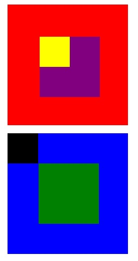

##  CAJAS

***

En la presente página web se visualiza la creacion de dos cuadrados con pequeños cuadrados inscritos en cada uno.
Para la realización de estas figuras se utilizaron los conceptos de position : relative , teniendo como padre al cuadrado rojo en el caso 1 y cuadrado azul en el caso dos.

La estructura del proyecto :
* Página principal index.html
* Hoja de estilos CSS main.CSS
